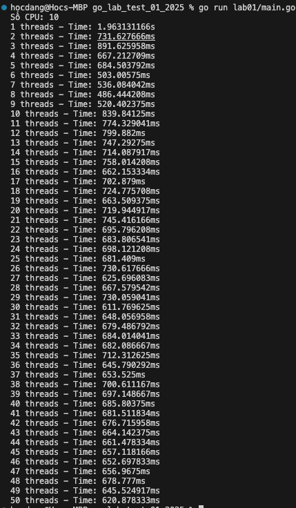
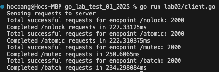
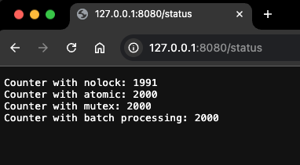

# Lab 01

```
$ go run lab01/main.go
```
### Kết quả

<div>
    
    </br></br>
</div>


=> Tối ưu số goroutines bằng số lõi CPU cho công việc CPU-bound. Với I/O-bound, có thể dùng nhiều hơn số lõi CPU. Test và điều chỉnh theo hiệu suất thực tế.


# Lab 02
### Server
```
$ go run lab02/server.go
```

### Client
```
$ go run lab02/server.go
```

### Kết quả
Từ client

<div>
    
    </br></br>
</div>

Từ server

<div>
    
    </br></br>
</div>

=> Khi nhiều requset gửi lên cùng lúc và xử lý đồng thời sẽ gây ra hiện tượng tranh chấp tài nguyên, ở ví dụ trên giả lập từ client gửi requet liên tục lên server và mỗi requet sẽ làm tăng biến đếm:

- Trường hợp 1: Không có cơ chế đồng bộ
  + Kết quả: Sai lệch dữ liệu khi số lượng request lớn.

- Trường hợp 2: Sử dụng Atomic
  + Kết quả: Dữ liệu chính xác do thao tác nguyên tử.
  + Ưu điểm: Hiệu suất cao, đơn giản.
  + Nhược điểm: Không phù hợp với các thao tác phức tạp.

- Trường hợp 3: Sử dụng Mutex
  + Kết quả: Đảm bảo dữ liệu chính xác tuyệt đối.
  + Ưu điểm: Đồng bộ hóa tốt cho các logic phức tạp.
  + Nhược điểm: Hiệu suất thấp, có thể gây độ trễ.

- Trường hợp 4: Sử dụng Batch
  + Kết quả: Tăng hiệu suất, dữ liệu cập nhật sau từng nhóm thao tác.
  + Ưu điểm: Giảm tải tranh chấp tài nguyên.
  + Nhược điểm: Dữ liệu không cập nhật ngay lập tức.